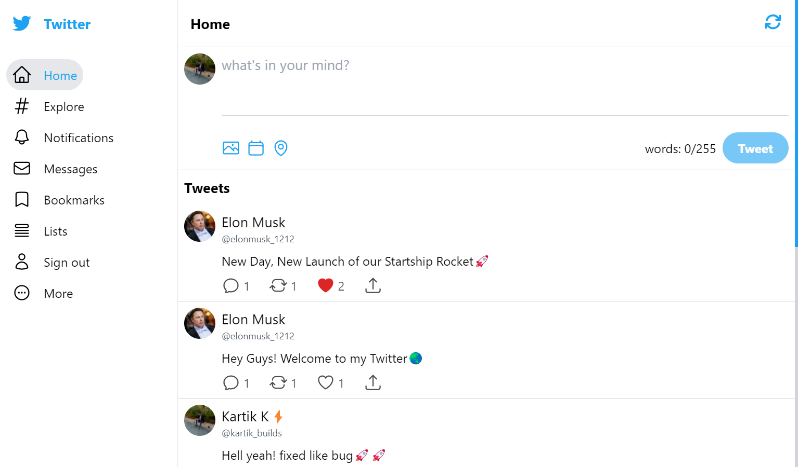
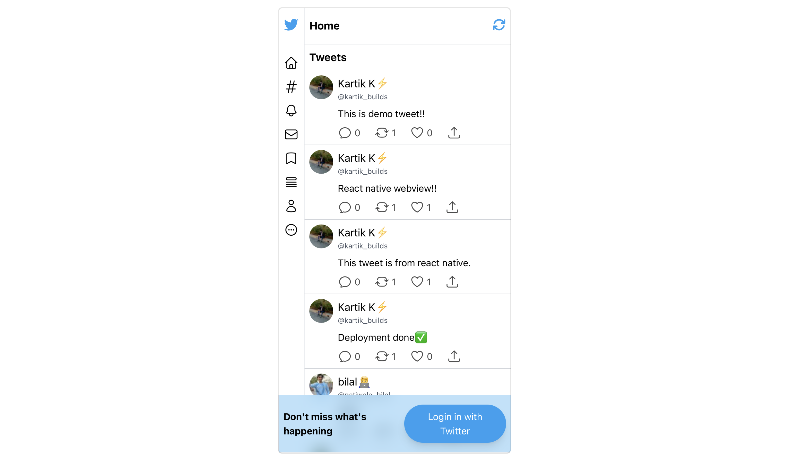

## Twitter Clone App

Desktop View


Mobile View


### **Features:**
* Login/Signup with Twitter - currently unavailable due to Twitter API Updates
* Create Tweets
* Like Tweets
* Comment on Tweets
* Follow/Unfollow Users
* View User Profile
* View User Followers/Following

### **Techstack:**
- Next.js
- Tailwind CSS
- Supabase
- Twitter API


Clone app:
```bash
git clone https://github.com/kartikk-k/twitter-clone.git
```

Run the development server:

```bash
npm run dev
# or
yarn dev
# or
pnpm dev
```

## Learn More
[Next.js Documentation](https://nextjs.org/docs) - learn about Next.js features and API.
